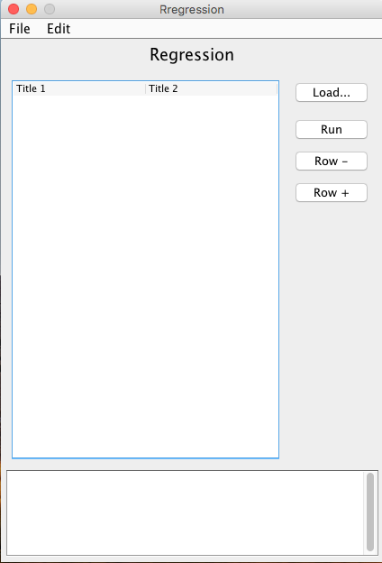
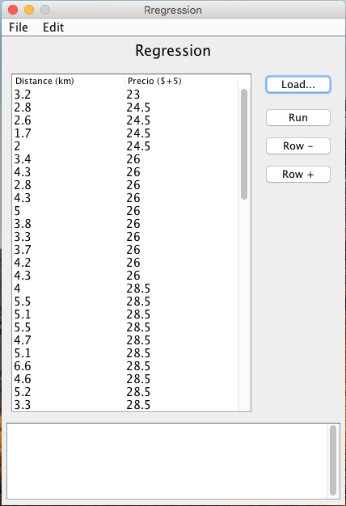
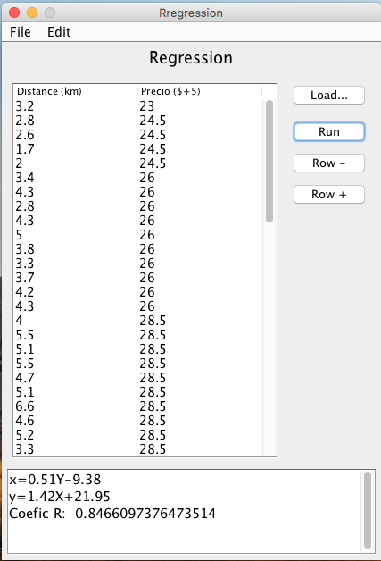

# Regression

App para obtener la ecuación de regresión lineal, cargando un archivo CSV con dos columnas

# Vistas

Capturas de la app







# Download & Run

[Descargar](https://github.com/jalmx/Regression-app/raw/master/dist/Regression.jar)

Ejecución de app, se debe ejecutar un script en caso que la máquina virtual (JVM) no esté bien configurada.

``` bash
    java -jar Regression.jar
```
